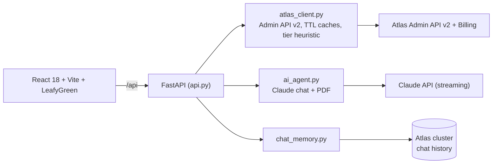

# Torre: Atlas Control Plane

One screen for an entire fleet of MongoDB Atlas clusters, with a Claude assistant grounded in the real clusters rather than generic MongoDB trivia. Ask whether an M30 is enough and it answers from the p95 CPU of *your* cluster.

Everything comes from the Atlas Admin API v2. The UI is in Brazilian Portuguese and so is the briefing documentation; the code is in English.

## The demo in five steps

**1. Overview: the whole fleet in one snapshot.** Clusters, status, cost, and alerts, without opening a dozen Atlas tabs.


**2. Health Score: one number, and where it came from.** 0 to 100, built from the Performance Advisor, COLLSCAN shapes, cluster status, and MongoDB version, with the open points per component.


**3. Scale: the tier answer, from the data.** 24h CPU (p95/average), memory, storage, and connections, next to the cluster's native auto-scaling status and a tier simulator.


**4. FinOps: the bill next to utilization.** Current invoice from the Billing API, estimated cost per cluster, and a verdict per row.


**5. AI chat: grounded in the fleet.** Streaming Claude with the cluster context attached and history persisted in Atlas.


Note what it does in that screenshot: asked about 24h, it says it only has the last 5 minutes and shows how to get the rest, instead of inventing a number.

Also in the menu: **Performance Advisor** (suggested indexes, one-click creation via pymongo, Claude analysis, PDF export), **Query Profiler** (slow queries parsed with a real `explain('executionStats')`), and **Compare** (two clusters side by side).

> The screenshots run against a real Atlas organization; project and cluster names were replaced with neutral ones.

## How the pieces fit



Three deliberate choices:

- **Credentials never leave the backend.** The frontend only talks to `/api`.
- **The assistant is fenced.** Its scope is restricted to Atlas (an "M30" is a tier, never a Kubernetes cluster) and it must separate real API data from pattern-based recommendation.
- **Cheap to keep open.** Reused HTTP session, TTL caches, and Anthropic prompt caching over the static system block, plus a ~2-minute cluster snapshot. Token spend appears in `GET /api/metrics`.

## Run it

Needs Python 3.10+, Node 18+, an [Atlas Admin API key](https://www.mongodb.com/docs/atlas/configure-api-access/), and an Anthropic key.

```bash
cp .env.example .env    # fill in the keys
./run_react.sh          # API :8765, UI :5290
```

The launcher uses a no-reload backend and an optimized frontend build by default. For reload/HMR development run `POV_DEV=1 ./run_react.sh`; the build is only redone when sources, lockfile, or configuration change.

```env
ATLAS_PUBLIC_KEY=
ATLAS_PRIVATE_KEY=
ATLAS_ORG_ID=
ANTHROPIC_API_KEY=
MONGODB_URI=                  # optional: index creation + chat history
CLAUDE_MODEL=claude-sonnet-5  # optional
API_AUTH_TOKEN=               # required when exposed beyond localhost
```

Override the ports with `API_PORT=8770 WEB_PORT=5295 ./run_react.sh`.

Docker (nginx serves the build and proxies `/api`):

```bash
docker build -t torre . && docker run --env-file .env -p 18085:8080 torre
```

## Operations assistant via MCP

The Assistant tab queries the cluster in natural language and prepares data, index, collection, and capacity operations. It has 28 tools, context shared across tabs, and explicit approval of changes. [Capabilities, configuration, and demo script](docs/assistant.md) (Portuguese).

## Tests

```bash
python -m unittest discover -s tests -v
```

27 pure-logic tests: scaling heuristic, injection guards for indexes/paths, chat-memory id validation. No credentials needed.

## Production boundary

Set a long, random `API_AUTH_TOKEN`; it protects the API routes and metrics while liveness stays public. Atlas errors are logged on the server and sanitized for clients, and index definitions accept only a safe field/direction per key. The image runs as UID 10001 behind nginx with security headers. In shared environments, prefer a real IdP/API gateway and private egress to Atlas.

## Layout

```
api.py              FastAPI routes, middleware, authentication
atlas_client.py     Admin API v2 client + scaling recommendations
ai_agent.py         Claude analysis, chat, PDF (streaming)
chat_memory.py      chat history in Atlas
observability.py    structured logs + /api/metrics
frontend/src/pages/ one component per page
```

## Credits

Based on Maestro by [Carime](https://github.com/carimeb) ([maestro-atlas-landing-zone](https://github.com/carimeb/maestro-atlas-landing-zone)).

MIT, see [LICENSE](LICENSE).
