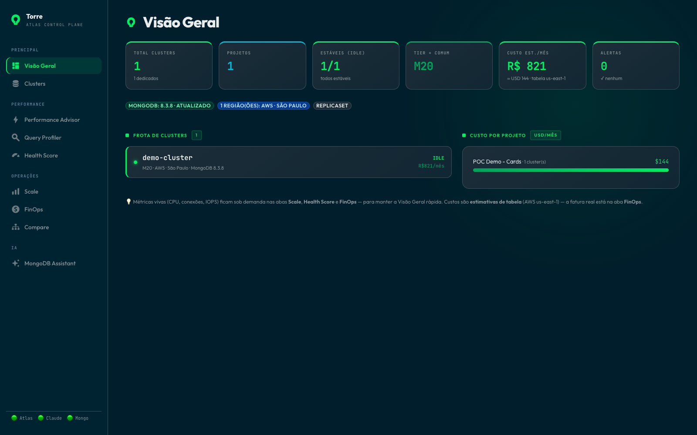
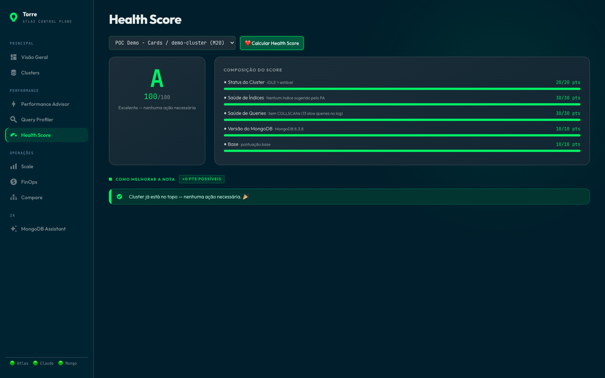
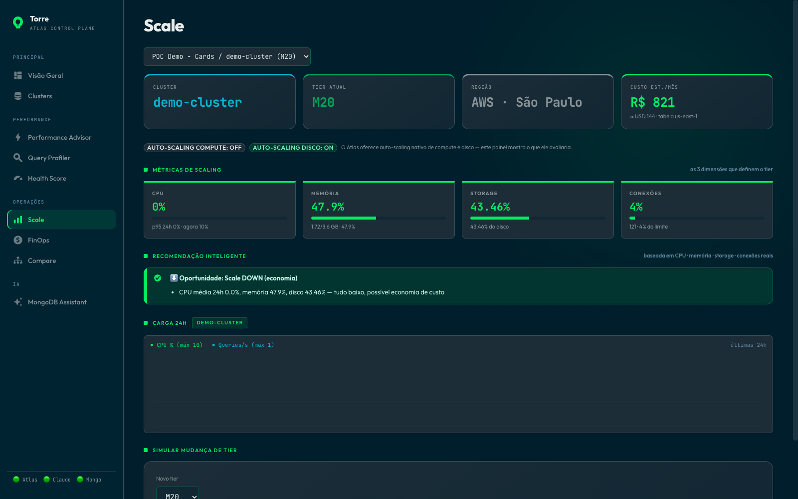
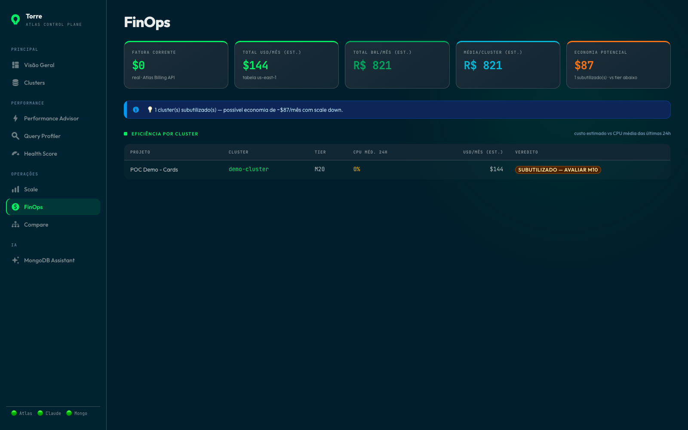
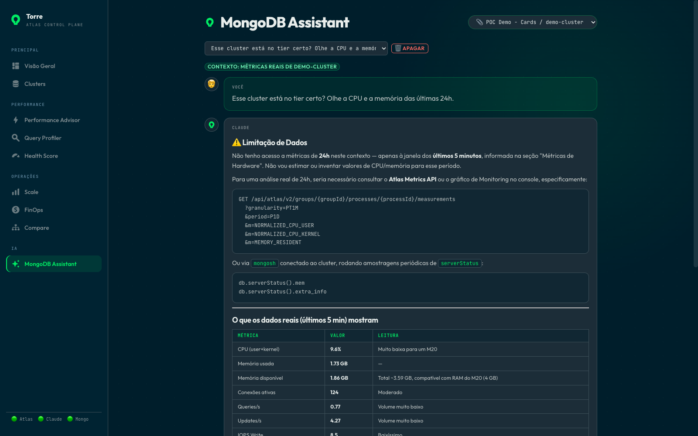
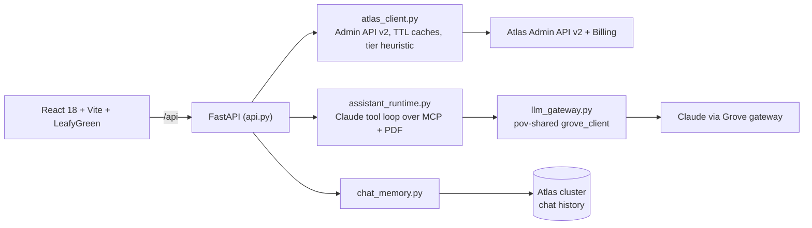

# Torre: Atlas Control Plane

Version **3.2.0** · [Changelog](CHANGELOG.md)

One screen for an entire fleet of MongoDB Atlas clusters, with a Claude assistant grounded in the real clusters rather than generic MongoDB trivia. Ask whether an M30 is enough and it answers from the p95 CPU of *your* cluster.

Everything comes from the Atlas Admin API v2. The UI is in Brazilian Portuguese and so is the briefing documentation; the code is in English.

## The demo in five steps

**1. Overview: the whole fleet in one snapshot.** Clusters, status, cost, and alerts, without opening a dozen Atlas tabs.



**2. Health Score: one number, and where it came from.** 0 to 100, built from the Performance Advisor, COLLSCAN shapes, cluster status, and MongoDB version, with the open points per component.



**3. Scale: the tier answer, from the data.** 24h CPU (p95/average), memory, storage, and connections, next to the cluster's native auto-scaling status and a tier simulator.



**4. FinOps: the bill next to utilization.** Current invoice from the Billing API, estimated cost per cluster, and a verdict per row.



**5. AI chat: grounded in the fleet.** Streaming Claude with the cluster context attached and history persisted in Atlas.



Note what it does in that screenshot: asked about 24h, it says it only has the last 5 minutes and shows how to get the rest, instead of inventing a number.

Also in the menu: **Performance Advisor** (suggested indexes, one-click creation via pymongo, Claude analysis, PDF export), **Query Profiler** (slow queries parsed with a real `explain('executionStats')`).

> The screenshots run against a real Atlas organization; project and cluster names were replaced with neutral ones.

## How the pieces fit



Three deliberate choices:

- **Credentials never leave the backend.** The frontend only talks to `/api`.
- **The assistant is fenced.** Its scope is restricted to Atlas (an "M30" is a tier, never a Kubernetes cluster) and it must separate real API data from pattern-based recommendation.
- **One gateway, fail closed.** Every Claude call goes through the Grove gateway via `pov-shared` (`grove_client`: retry/backoff on 429/5xx, circuit breaker, key failover). Without `GROVE_BASE_URL` + `GROVE_API_KEY` the assistant is disabled; there is no fallback to a direct provider key. Token spend appears in `GET /api/metrics`; Langfuse traces are masked (CPF, e-mail, phone, card, connection strings) before they are created.
- **Cheap to keep open.** Reused HTTP session, TTL caches and a ~2-minute cluster snapshot.

## Run it

Needs Python 3.12+, Node 18+, `uv`, an [Atlas Admin API key](https://www.mongodb.com/docs/atlas/configure-api-access/), the Grove gateway credentials, and the private `pov-shared` package checked out next to this repo (`../_shared`).

```bash
cp .env.example .env                       # fill in Atlas + Grove (or run ../_shared/sync_env.py)
python3 -m venv venv                       # the only venv this repo uses
venv/bin/pip install -r requirements.txt
uv pip install --python venv/bin/python -e "../_shared[llm]"   # grove_client + guardrails
./run_react.sh                             # API 127.0.0.1:8765, UI 127.0.0.1:5290
```

`run_react.sh` does the three install steps by itself when they are missing (it creates `./venv`, installs the requirements and `../_shared[llm]`, and reinstalls `frontend/node_modules` when Vite is absent). It uses a no-reload backend and an optimized frontend build by default. For reload/HMR development run `POV_DEV=1 ./run_react.sh`; the build is only redone when sources, lockfile, or configuration change.

```env
ATLAS_PUBLIC_KEY=
ATLAS_PRIVATE_KEY=
ATLAS_ORG_ID=
GROVE_BASE_URL=               # LLM gateway; assistant is disabled without it
GROVE_API_KEY=
MONGODB_URI=                  # optional: index creation, chat history, assistant data tools
MONGODB_DB=torre              # optional: database for Torre's own state
CLAUDE_MODEL=claude-sonnet-5  # optional (haiku is mapped to claude-sonnet-5-5)
API_AUTH_TOKEN=               # required when exposed beyond localhost
```

Override the ports with `API_PORT=8770 WEB_PORT=5295 ./run_react.sh`.

Docker (nginx serves the build and proxies `/api`; `pov-shared` comes from a named build context):

```bash
docker build --build-context shared=../_shared -t torre . && docker run --env-file .env -p 18085:8080 torre
```

### Reset the demo state

```bash
venv/bin/python scripts/reset_demo.py --db torre_test --workload-db banco_inter_test   # rehearsal
ALLOW_DEMO_DB_WRITE=1 venv/bin/python scripts/reset_demo.py                             # the demo itself
```

Idempotent. It recreates what Torre writes: `chat_history` (empty, with its five indexes and TTL), the LangGraph checkpoint collections, the local approvals in `.assistant-state/actions.sqlite3`, and only the `eventos_pix` documents that `populate_workload.py` tagged with `_torre_workload: true`. It refuses the demo databases without `ALLOW_DEMO_DB_WRITE=1`; `*_test` databases are always accepted. Atlas itself (clusters, metrics, Advisor, Profiler) and the pre-existing `banco_inter` dataset are read-only inputs and are never touched.

### Load generators and the `$regex` exception

Torre's app code never uses `$regex` (text search is `$search`; the assistant's data tools reject `$regex` outside `explain`). The three load generators are the documented exception: `populate_profiler.py`, `populate_workload.py` and `stress_readonly.py` run case-insensitive prefix regexes on purpose, because those queries cannot use index bounds and produce the slow, COLLSCAN-heavy entries the Query Profiler and Performance Advisor have to show. `populate_workload.py` only writes with `ALLOW_DEMO_DB_WRITE=1`.

## FinOps por nó

FinOps compara CPU média dos nós em intervalos comuns de cinco minutos, p95 do nó mais carregado, janela recente e cobertura real de 24h. Dados ausentes e clusters pausados têm estados explícitos. Redução de tier exige cobertura de pelo menos 90% e permanece condicionada à validação do tier alvo. O botão **Analisar com MCP + LLM** coleta métricas, Advisor e queries recentes por MCP e gera uma resposta do modelo com progresso e prazo limitado. `explain` aprofundado fica no Assistente. A API de mensagens chama Claude; o MCP conecta o modelo às ferramentas de dados. Todos os caminhos de análise/chat da UI, inclusive rotas de compatibilidade, usam esse runtime MCP.

Carga de validação somente leitura, com rampa de concorrência e limite de cinco segundos por consulta:

```bash
venv/bin/python stress_readonly.py --minutes 6 --workers 6 --output /tmp/torre-stress.json
```

O launcher inicia essa carga automaticamente por 6 minutos, com até 6 workers. Use `TORRE_STRESS=0 ./run_react.sh` para abrir sem carga, ou configure `STRESS_MINUTES` e `STRESS_WORKERS`. O encerramento da PoV interrompe a carga; um lock impede testes duplicados. Logs/resultados ficam em `.assistant-state/startup-stress.*`.

Escala consulta os indicadores a cada 5 segundos, com nova coleta Atlas em cada ciclo e proteção contra consultas simultâneas duplicadas. Mostra o horário da consulta e da amostra CPU por nó. O histórico continua sendo usado para decidir capacidade, mesmo sem os gráficos de 24h na tela.

O script exige as coleções existentes `banco_inter.transacoes` e `banco_inter.fatura`, utiliza primary e secondaries, não altera dados e encerra após o prazo. Resultados sintéticos não substituem histórico de produção. Estimativas de custo usam tabela de referência AWS us-east-1; incluem tiers pausados e não representam cobrança real.

## Operations assistant via MCP

The Assistant tab queries the cluster in natural language and prepares data, index, collection, and capacity operations. It has 29 tools (12 of them only prepare changes), context shared across tabs, and explicit approval of changes. [Capabilities, configuration, and demo script](docs/assistant.md) (Portuguese).

## Tests

```bash
venv/bin/python -m unittest discover -s tests -v
cd frontend && node --test tests/*.test.mjs
```

Offline, no credentials needed: scaling heuristic, injection guards, chat-memory ids, the assistant graph, and `tests/test_hardening_adversarial.py` (gateway fail-closed and 429/5xx retry, PII never reaching Langfuse, prompt injection and tool abuse, hostile ids and payloads, Atlas 429/5xx/timeouts, concurrent approvals, reset guard). Tests force the in-memory checkpointer, so they never write to a real database.

## Production boundary

Set a long, random `API_AUTH_TOKEN`; it protects the API routes and metrics while liveness stays public. Atlas errors are logged on the server and sanitized for clients, and index definitions accept only a safe field/direction per key. The image runs as UID 10001 behind nginx with security headers. In shared environments, prefer a real IdP/API gateway and private egress to Atlas.

## Layout

```
api.py              FastAPI routes, middleware, authentication
atlas_client.py     Admin API v2 client + scaling recommendations
llm_gateway.py      the only LLM entry point (Grove via pov-shared, fail closed)
assistant_*.py      MCP tool loop (LangGraph), tools, approvals, reports
ai_agent.py         model settings, token accounting, PDF export
tracing.py          Langfuse traces, masked before creation (fail-open)
scripts/            reset_demo.py
chat_memory.py      chat history in Atlas
observability.py    structured logs + /api/metrics
frontend/src/pages/ one component per page
```

## Credits

Based on Maestro by [Carime](https://github.com/carimeb) ([maestro-atlas-landing-zone](https://github.com/carimeb/maestro-atlas-landing-zone)).

MIT, see [LICENSE](LICENSE).
